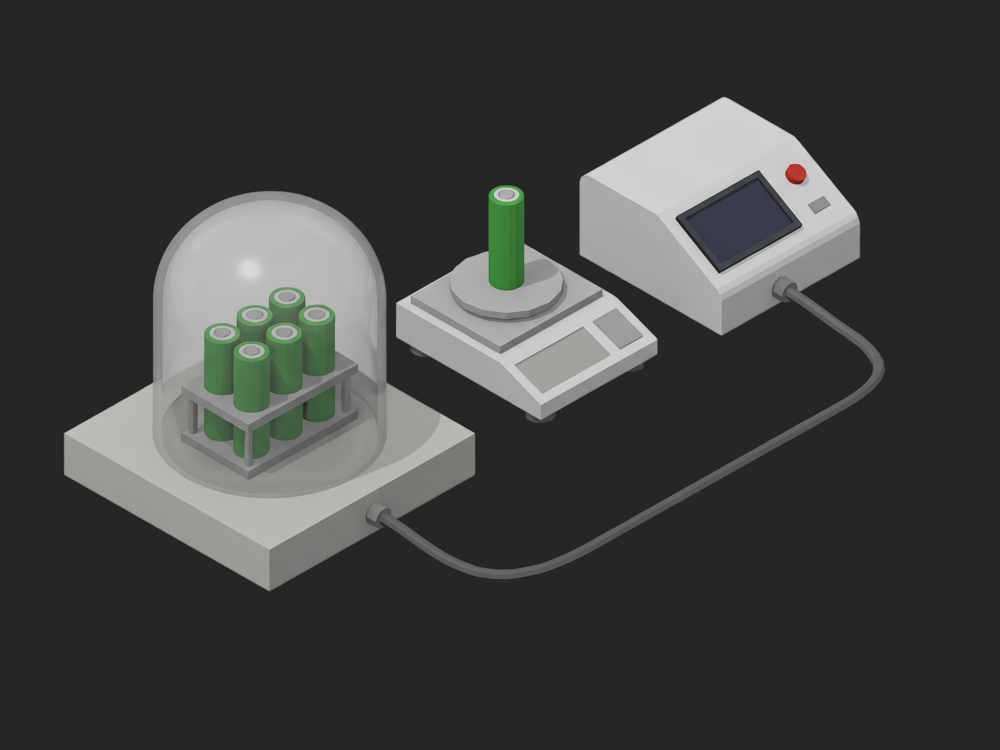

# Framework Battery Cell Screening with Vacuum



A TofuPilot Framework procedure for the 100 % screening of COTS 18650 cells going into a smallsat battery: a visual result in setup, then mass, open-circuit voltage, AC impedance at 1 kHz and a C/2 discharge capacity before and after six hours under vacuum, the cell accepted on how little the four numbers changed, after the NR-SRD-139 criteria (OCV within 0.1 %, capacity within 5 %, mass within 0.1 %) plus the programme's own impedance criterion. The mock bench synthesizes a healthy 3.42 Ah cell that loses 4 mg and 0.6 % of capacity under vacuum.

## What This Shows

| Feature | Where |
|---------|-------|
| One characterisation function shared by the pre and post phases, addressing prefixed measurement keys | `phases/characterise.py`, `setattr(measurements, f"mass_{prefix}_g", ...)` |
| Absolute limits before, deltas after, on the same four quantities | `mass_pre_g`, `ocv_pre_v`, `acir_pre_mohm`, `discharge_pre.capacity_ah` and `*_delta_pct` |
| Measurements kept without limits because the delta is the judgement | `mass_post_g`, `ocv_post_v`, `acir_post_mohm` |
| A boolean validated with `==` | `visual_ok == true` |
| Reference passed between phases through the plug | `bench.store("pre", ...)`, `bench.recall("pre")` |
| Time under a threshold as an aggregation of a pressure curve | `exposure.pressure.hours_under_h >= 5.5` |
| Progress component on a time-scaled exposure, teardown that records the storage voltage | `vacuum`, `release` |

## Get Started

1. Sign up for a free TofuPilot account at [tofupilot.app](https://www.tofupilot.app/auth/signup).
2. Open the **New Procedure** flow in the dashboard and clone this template.
3. Follow the dashboard's instructions to set up a station and run the procedure.

For deeper guides, see the [TofuPilot docs](https://www.tofupilot.com/docs/framework) and the [Battery Cell Screening with Vacuum template page](https://www.tofupilot.com/templates/battery-cell-screening-with-vacuum).

## Structure

```
.
├── procedure.yaml                    # Procedure, plug, phases, measurements
├── phases/
│   ├── identify.py                   # Setup: visual result, vendor code
│   ├── characterise.py               # Shared: mass, OCV, ACIR, C/2 discharge
│   ├── pre_screen.py                 # Before, reference stored on the plug
│   ├── vacuum.py                     # 6 h under vacuum, pressure curve
│   ├── post_screen.py                # After, four deltas to the reference
│   └── release.py                    # Teardown: OCV at storage
├── plugs/
│   └── cell_bench.py                 # Mock cycler + impedance meter + balance + chamber
├── utils/
│   └── recipe.py                     # Cell data, limits, exposure, delta criteria
├── pyproject.toml                    # uv-managed Python project
└── README.md
```

## Replace the Mock with Real Hardware

`plugs/cell_bench.py` maps to a Neware, Arbin or Chroma cycler channel over its API for the charge and the C/2 discharge, a Hioki BT3562 for OCV and ACIR at 1 kHz, a Sartorius or Mettler balance over RS-232, and a bell-jar chamber with a Pirani gauge. Set `TIME_SCALE = 1.0` in `utils/recipe.py`. Run the vibration screening as its own procedure between the pre and post characterisations if the programme requires it; the delta criteria are the same. The phases, measurements and limits stay the same.
